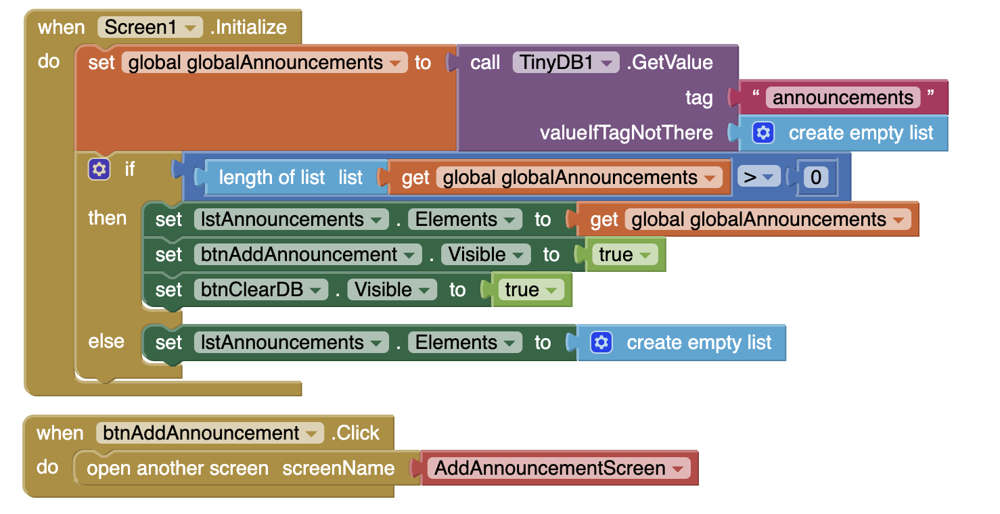
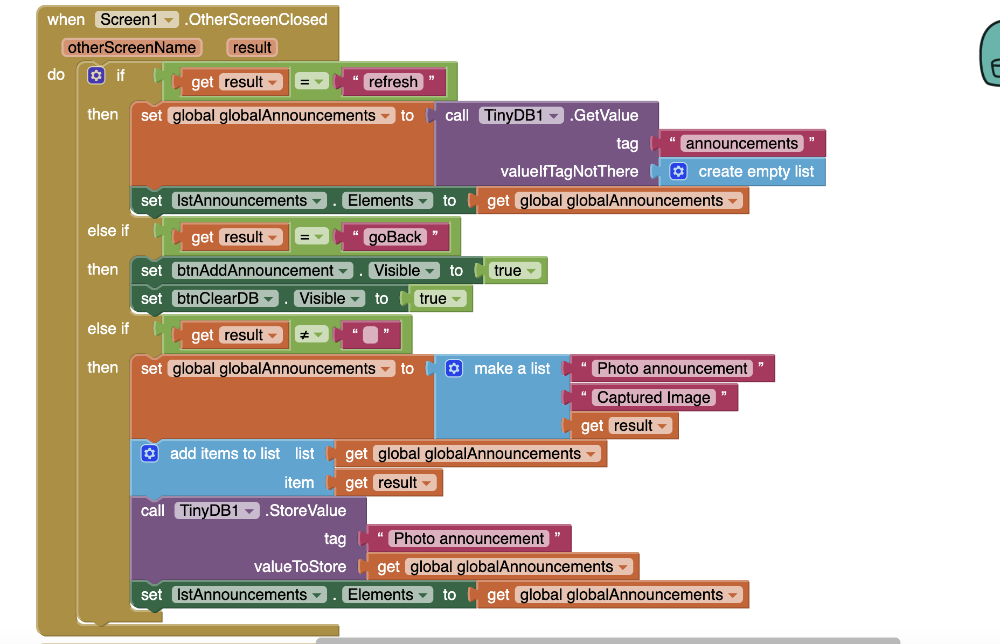
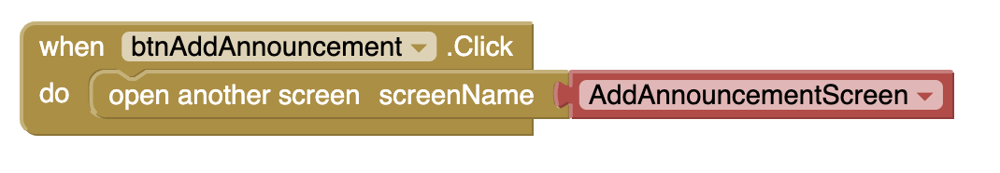
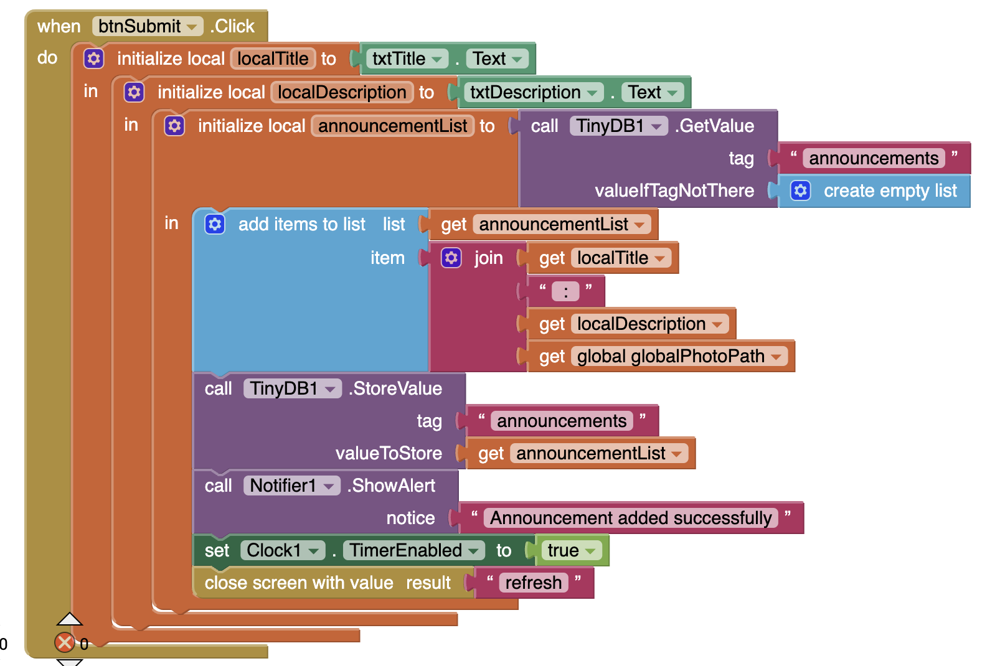
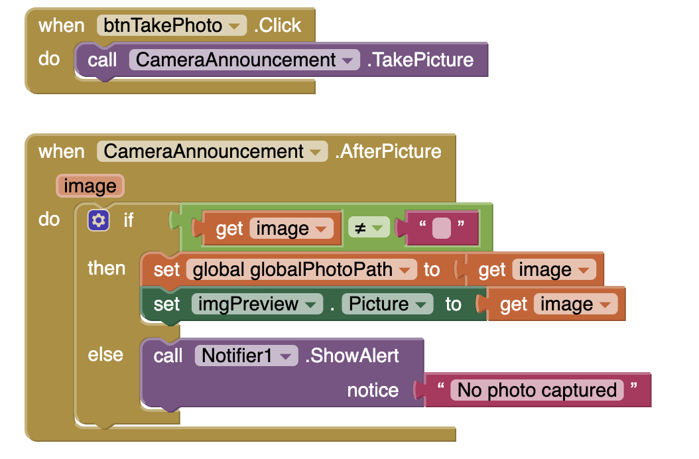

# MIT App Inventor Project

# Social Event Announcement App

A **mobile application** built with **MIT App Inventor** to help users **create** and **view** community or social event announcements in a simple, centralized manner. This project allows users to attach a **photo** to each announcement, storing both the text and the image path in persistent storage via **TinyDB**. There are two versions that I made due to a my implementation reasons. Version 1.0 has just the text title and description that can be added as an announcement. Version 1.1 has an added image component that will store the image and display the path of the stored image (not the image itself).

---

## Table of Contents
- [MIT App Inventor Project](#mit-app-inventor-project)
- [Social Event Announcement App](#social-event-announcement-app)
  - [Table of Contents](#table-of-contents)
  - [Overview](#overview)
  - [Motivation](#motivation)
  - [Features](#features)
  - [Platforms \& Technologies Used](#platforms--technologies-used)
  - [App Structure](#app-structure)
  - [Development Process](#development-process)
  - [Explanation of Key Code Blocks](#explanation-of-key-code-blocks)
    - [1. Screen1 Blocks](#1-screen1-blocks)
    - [1. AddAnnouncementScreen Blocks](#1-addannouncementscreen-blocks)
  - [Setup Instructions](#setup-instructions)
  - [Insights \& Learnings](#insights--learnings)
  - [Future Improvements](#future-improvements)
  - [License](#license)
  - [References](#references)
  - [Official MIT App Inventor Documentation](#official-mit-app-inventor-documentation)
  - [Video Tutorials \& Learning Resources](#video-tutorials--learning-resources)
  - [Tools for Testing \& Debugging](#tools-for-testing--debugging)
  - [OpenAI ChatGPT-4o](#openai-chatgpt-4o)

---

## Overview
**Social Event Announcement App** is a simple yet effective way to post and view community or social event announcements. Each announcement can contain **title**, **description**, and an **optional photo** captured with the device’s camera. The announcements are displayed in a **ListView**, where users can see their text entries and share them if desired. This app uses **MIT App Inventor**’s blocks-based programming environment, offering quick development and ease of maintenance.

---

## Motivation
Often, important announcements—like club meetings, social gatherings, or lost-and-found items—are shared across disparate social media or pinned on a physical board. This app seeks to:
1. **Centralize** these announcements in one mobile application.  
2. **Simplify** the process of capturing a related photo.  
3. **Provide** a quick overview of announcements without resorting to lengthy email threads or scattered messaging apps.

---

## Features
1. **Add Announcement**  
   - Users can enter **Title** and **Description**.  
   - An **optional photo** can be captured using the **Camera** component.  
   - The new announcement is saved to **TinyDB**, ensuring it persists after closing the app.

2. **View Announcements**  
   - A **ListView** on the main screen (`Screen1`) displays all announcements loaded from **TinyDB**.  
   - Each list item shows the **title** (and optionally description) of the announcement.  
   - Currently, the image path is stored if a photo is captured.

3. **Photo Capture**  
   - Integrates with the **Camera** component from MIT App Inventor.  
   - Stores the image path for potential viewing or sharing.

4. **Persistent Data**  
   - Uses **TinyDB** to keep data on the device even after the app is closed.

5. **Share Announcements** (Optional Enhancement)  
   - By tapping on an announcement, users can share its text via Email, Messaging apps, etc., if the Sharing component is implemented.

---

## Platforms & Technologies Used
- **MIT App Inventor**: Primary development platform.  
- **Camera Component (MIT App Inventor)**: Captures images and returns a file path.  
- **TinyDB (MIT App Inventor)**: Stores announcements locally on the device.  
- **ListView (MIT App Inventor)**: Displays announcements in a scrollable list.
- **Social Sharing Component (MIT App Inventor)**: Allows users to share the event details through other applications.

---

## App Structure
1. **Screen1 (Main Screen)**  
   - Shows a **ListView** of all announcements.  
   - Includes **buttons** 
   - (`btnAddAnnouncement`) to open `AddAnnouncementScreen`.
   - (`btnClearDB`) to clear the announcements.

2. **AddAnnouncementScreen**  
   - Users can **input a title and description** for a new announcement.  
   - They can optionally **capture a photo** using the camera.  
   - The announcement is stored in **TinyDB**, and the screen closes, returning to `Screen1` with a signal to refresh.

---

## Development Process
1. **Planning & Design**  
   - Chose MIT App Inventor for quick visual development.  
   - Determined key features (text-based announcements, optional photo capture, and a simple ListView).

2. **Screen & Component Setup**  
   - **Screen1**: Added a **ListView** to display announcements and a button to open `AddAnnouncementScreen`.  
   - **AddAnnouncementScreen**: Added text boxes for **Title** and **Description**, a **Camera** component, and a **Submit** button to save data in TinyDB.

3. **Data Storage**  
   - Used **TinyDB** with the tag `"announcements"`.  
   - Each announcement is stored as a small list: `[Title, Description, PhotoPath?]`.

4. **Camera Integration**  
   - **Camera.TakePicture** triggers `AfterPicture(imagePath)`.  
   - If `imagePath` is valid, it’s appended to the announcement details in **TinyDB**.

5. **Returning to Screen1**  
   - After adding an announcement, the app closes `AddAnnouncementScreen` with `"refresh"`.  
   - `Screen1.OtherScreenClosed` detects this value and **reloads** announcements from TinyDB.

6. **Testing & Refinements**  
   - Tested camera capture on multiple devices.  
   - Ensured data persisted correctly, and the ListView displayed all announcements.

---

## Explanation of Key Code Blocks

Below is a general overview of how the main blocks are arranged to make the app function:

### 1. Screen1 Blocks

Purpose: When Screen1 opens, it loads any previously stored announcements from TinyDB and sets them in the ListView.

Purpose: When returning from AddAnnouncementScreen, if the screen returns "refresh", it reloads announcements from TinyDB and updates the list.

Purpose: Opens the AddAnnouncementScreen where new announcements can be created.

### 1. AddAnnouncementScreen Blocks

Purpose: Collects the user inputs (title, description, optional photo path), updates the TinyDB announcements list, and closes with "refresh" so Screen1 can reload.

Handles taking a photo and storing the returned image path in globalPhotoPath. Displays a preview if desired.

Adds a short delay which helped me solve the issue with TinyDB not loading/storing the data correctly.

## Setup Instructions

1. **Download or Clone the `.aia` File**  
   - Obtain `SocialProject.aia` from this repository.

2. **Open MIT App Inventor**  
   - Go to [MIT App Inventor Website](https://appinventor.mit.edu/) and **log in**.

3. **Import the Project**  
   - **Projects → Import project (.aia)**.  
   - Select `SocialProject.aia`.

4. **Test on Device**  
   - **Connect → AI Companion** or use an emulator.  
   - Scan the QR code or enter the code in the AI Companion app.

5. **Usage**  
   - In `Screen1`, tap **“Add Announcement”**.  
   - **Enter** a title, description, and optionally tap **“Capture Photo”**.  
   - **Submit** to save. Return to `Screen1` to see your new announcement in the list.

---

## Insights & Learnings
1. **Camera vs. File Path Display**  
   - By default, the file path is stored. The ListView is text-based, so it only shows the raw path unless you format it differently (e.g., “Photo Captured”).

2. **TinyDB for Persistence**  
   - Straightforward for small-scale data but not suited for multi-user or large-scale apps without additional logic.

3. **Screen Communication**  
   - Reliance on `close screen with value` and `OtherScreenClosed` ensures an automatic refresh in `Screen1`.

4. **Enhancing User Experience**  
   - Replacing the path with a more user-friendly text (e.g., “Photo Attached”) in the ListView can make the UI cleaner.

---

## Future Improvements
- **Show Thumbnail in ListView**  
  - MIT App Inventor’s native ListView doesn’t support images natively. I am considering to add a dynamic or extension-based approach to display thumbnails instead of just text.
- **Search & Filter**  
  - Adding a category filter to quickly find announcements.
- **Cloud Connectivity**  
  - Migrate to a web database for multiple users and real-time syncing.
- **Notifications**  
  - Add local or push notifications when a new announcement is posted (for multi-user scenarios).

---

## License
This project is released under the [MIT License](LICENSE). You’re free to use, modify, and distribute this code for **educational** or **personal** projects.

---

**Thank you for exploring the _Social Event Announcement App_!**  
Feel free to adapt and expand this project to meet your community or event-sharing needs. If you have any questions, open an issue or reach out with suggestions!

## References

## Official MIT App Inventor Documentation

1. [**MIT App Inventor Homepage**](https://appinventor.mit.edu/)  
   - The official website for MIT App Inventor.

2. [**MIT App Inventor Documentation**](https://ai2.appinventor.mit.edu/reference/components/)  
   - Detailed explanations for **all components**.

3. [**TinyDB Documentation**](https://ai2.appinventor.mit.edu/reference/components/storage.html#TinyDB)  
   - Learn how **TinyDB** works for local data storage.

4. [**Camera Component Documentation**](https://ai2.appinventor.mit.edu/reference/components/media.html#Camera)  
   - Guide on using the **Camera** component to take pictures.

5. [**ListViewer Component Documentation**](https://ai2.appinventor.mit.edu/reference/components/userinterface.html#ListView)  
   - Learn how to use **ListViewer** to display lists of items.

6. [**Sharing Component Documentation**](https://ai2.appinventor.mit.edu/reference/components/connectivity.html#Sharing)  
   - Guide on using the **Sharing** component to share text or images via external apps.

---

## Video Tutorials & Learning Resources

1. [**MIT App Inventor YouTube Channel**](https://www.youtube.com/c/MITAppInventor)  
   - Official video tutorials from MIT.

2. [**App Inventor Beginner's Guide (YouTube Playlist)**](https://www.youtube.com/playlist?list=PLGnrwzGb5x1AnAqIR_WmMQzNofbC9_Fri)  
   - Step-by-step tutorials for getting started with MIT App Inventor.

3. [**How to Use TinyDB in MIT App Inventor**](https://www.youtube.com/watch?v=ZHJRxO3RtL0)  
   - Video tutorial on using **TinyDB** for storing and retrieving data.

4. [**How to Capture and Display Images with MIT App Inventor**](https://www.youtube.com/watch?v=-R2aMefcYUA)  
   - Learn how to take and display images using the **Camera** component.

5. [**Using ListView to Display Data in MIT App Inventor**](https://www.youtube.com/watch?v=2Zx_K_5vqhk)  
   - Tutorial on displaying lists of items using **ListViewer**.

---

## Tools for Testing & Debugging

- **MIT AI2 Companion App**  
  - Download on [Google Play Store](https://play.google.com/store/apps/details?id=edu.mit.appinventor.aicompanion3)  
  - Download on [Apple App Store](https://apps.apple.com/us/app/mit-ai2-companion/id1436339855)  

- [MIT App Inventor Emulator](https://appinventor.mit.edu/explore/ai2/setup-emulator)  
  - Instructions for setting up an **emulator** if you don’t have a physical Android device.

---

## OpenAI ChatGPT-4o
https://chatgpt.com/share/67b2d7b7-a19c-800b-b0ba-dd303a9d443e